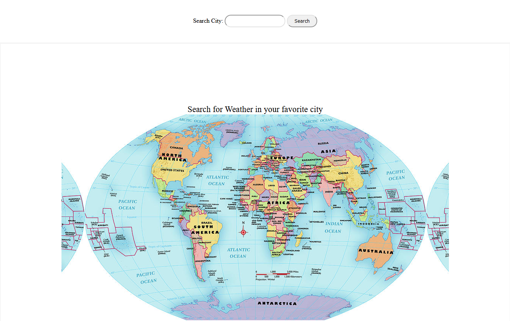
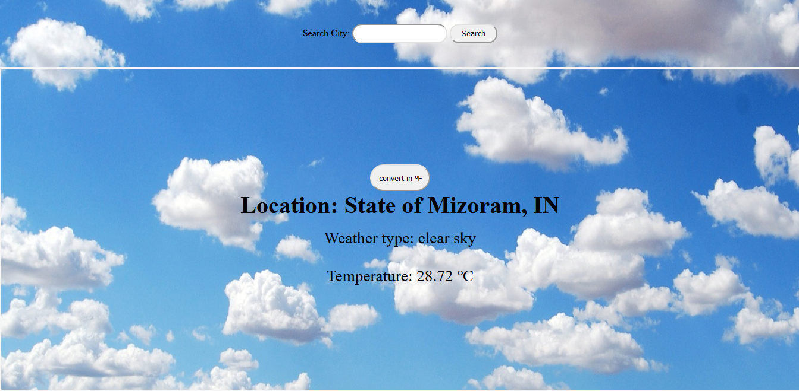
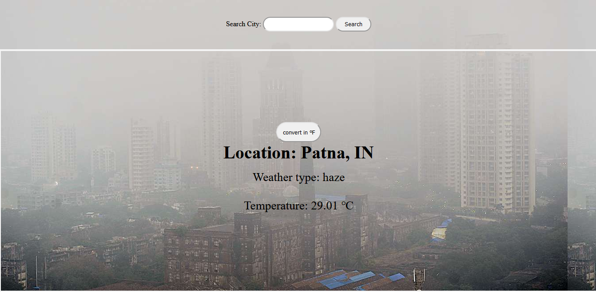

# Weather_App

This is a weather application made using javascript. A user can search for any city and my application will fetched from Open_weather_api and give you the current location, temperature, and humidity. The user can also change the temperature from fahrenheit to celcius and vice-versa.

<div align="center">

[](https://github.com/Dipeshtwis/Weather_App/JS-to-do-list)
[](https://github.com/Dipeshtwis/Weather_App/issues)
[](https://github.com/Dipeshtwis/Weather_App/pulls)

</div>

## 📝 Contents

<p align="center">
<a href="#with">Built with</a>&nbsp;&nbsp;&nbsp;|&nbsp;&nbsp;&nbsp;
<a href="#sc">Screenshot</a>&nbsp;&nbsp;&nbsp;|&nbsp;&nbsp;&nbsp;
<a href="#ll">Live Demo Link</a>&nbsp;&nbsp;&nbsp;|&nbsp;&nbsp;&nbsp;
<a href="#gs">Getting started</a>&nbsp;&nbsp;&nbsp;|&nbsp;&nbsp;&nbsp;
<a href="#author">Author</a>
</p>

## 🔧 Built with<a name = "with"></a>

- JavaScript
- HTML 5 and CSS 3
- Open Weather API

## Project Screenshot <a name = "sc"></a>








## Live Demo Link <a name = "ll"></a>

[Live Demo](https://dipestwis.github.io/Weather_App/)


## Getting Started <a name = "gs"></a>

To get a local copy of the repository please run the following commands on your terminal:

```
$ cd <folder>
```

~~~bash
$ git clone https://github.com/Dipeshtwis/Weather_App.git
$ cd Weather_App

~~~

## For Webpack

~~~bash

$ npm run build

$ npm run start

~~~


## ✒️  Authors <a name = "author"></a>


👤 **Dipesh Kumar**

- Github: [@Dipeshtwis](https://github.com/Dipeshtwis)
- Twitter: [@97deepeshkumar](https://twitter.com/97deepeshkumar)
- Linkedin: [dipeshtwis](https://www.linkedin.com/in/dipeshtwis/)


## 🤝 Contributing

Contributions, issues and feature requests are welcome!

Feel free to check the [issues page](https://github.com/Dipeshtwis/Weather_App/issues).


## 👍 Show your support

Give a ⭐️ if you like this project!

## :clap: Acknowledgements

- Microverse: [@microverse](https://www.microverse.org/)

- [The Odin Project](https://www.theodinproject.com/courses/javascript/lessons/weather-app)

## 📝 License

This project is [MIT](./LICENSE) licensed.